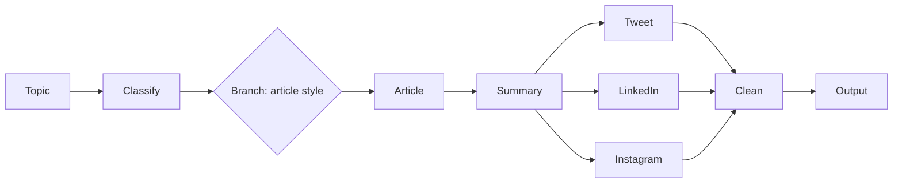

# AI Content Repurposing Pipeline

A multi-step LLM pipeline that turns **one topic** into **platform-ready content**. It classifies the topic, writes an article in a matching style, summarizes it, and generates a tweet, a LinkedIn post, and an Instagram caption in parallel.

Built to practice LangChain's **output parsers, sequential, parallel and conditional chains, and runnables** (LCEL).


## Features

- **Topic classification** into technical, news, or casual, with structured output
- **Style-aware article writing**: a different prompt and tone for each category
- **Summarization** of the article into 5 lines
- **Parallel generation** of a tweet, a LinkedIn post, and an Instagram caption
- **Post-processing** that trims text and checks the 280-character tweet limit
- **Streamlit UI** to try it in the browser

## How it works



| Step | What happens | LangChain concept |
|---|---|---|
| 1. Classify | Labels the topic as `technical`, `news` or `casual` | `PydanticOutputParser` |
| 2. Write article | Picks a prompt based on the category | `RunnableBranch` (conditional chain) |
| 3. Summarize | Condenses the article into 5 lines | Sequential chain |
| 4. Generate posts | Tweet, LinkedIn and Instagram at the same time | `RunnableParallel` |
| 5. Clean up | Trims text and validates tweet length | `RunnableLambda` |
| Throughout | Carries data from step to step | `RunnablePassthrough.assign()` |

## Tech stack

- Python 3.12
- [LangChain](https://python.langchain.com/) (LCEL)
- Hugging Face Inference (`meta-llama/Llama-3.1-8B-Instruct`)
- Pydantic
- Streamlit

## Project structure

```
content-repurposer-langchain/
├── app.py            # Streamlit UI
├── chains.py         # model setup and all chains (the pipeline)
├── prompts.py        # all prompt templates
├── schemas.py        # Pydantic models for structured output
├── requirements.txt
├── .gitignore
└── README.md
```

## Getting started

### 1. Clone the repo

```bash
git clone https://github.com/YOUR_USERNAME/content-repurposer-langchain.git
cd content-repurposer-langchain
```

### 2. Create a virtual environment (recommended)

```bash
python -m venv venv
venv\Scripts\activate        # Windows
source venv/bin/activate     # macOS / Linux
```

### 3. Install dependencies

```bash
pip install -r requirements.txt
```

### 4. Add your Hugging Face token

Create a token at [huggingface.co/settings/tokens](https://huggingface.co/settings/tokens) and make sure it can call Inference Providers. Then create a file named `.env` in the project folder:

```
HUGGINGFACEHUB_API_TOKEN=your_token_here
```

> The Llama model is gated. Accept its license on the model page first, or switch `repo_id` in `chains.py` to `Qwen/Qwen2.5-7B-Instruct`.

### 5. Run it

Test the pipeline in the terminal:

```bash
python chains.py
```

Launch the web app:

```bash
streamlit run app.py
```

## What I learned

- **Model size matters.** A 1B model (TinyLlama) ignored instructions like "write a 5 line summary". Switching to an 8B instruct model fixed it. Model choice matters as much as chain design.
- **Data flows as dicts.** Each step needs the earlier outputs, so `RunnablePassthrough.assign()` keeps the dict growing instead of overwriting it. Key names must match the `{variables}` in the prompts.
- **Prompts are requests, not guarantees.** The model can break a "max 280 characters" rule, so a `RunnableLambda` validates the output in plain Python.
- **Test each chain alone** with `.invoke()` before connecting them. Debugging a 6-step chain is much easier that way.
- **Structured output needs strict parsing.** A Pydantic `Literal` type makes the classifier reliable.

## Troubleshooting

| Problem | Fix |
|---|---|
| `You must provide an api_key` | Check that `.env` is in the same folder as `chains.py` and the variable name is exact |
| 403 / not authorized for Llama | Accept the model license on Hugging Face, or use Qwen |
| `OutputParserException` in classifier | The model returned extra text. Re-run, or lower the temperature |
| `UnicodeEncodeError` when printing | Add `sys.stdout.reconfigure(encoding='utf-8')` at the top of `chains.py` |
| `KeyError: missing variables` | Check the `pipeline` order and that prompt variables match the dict keys |

## 🙋 Author

**Pushkar Tiwari**
[LinkedIn](https://www.linkedin.com/in/YOUR_PROFILE) · [GitHub](https://github.com/YOUR_USERNAME)

*If you found this useful, give the repo a ⭐*
